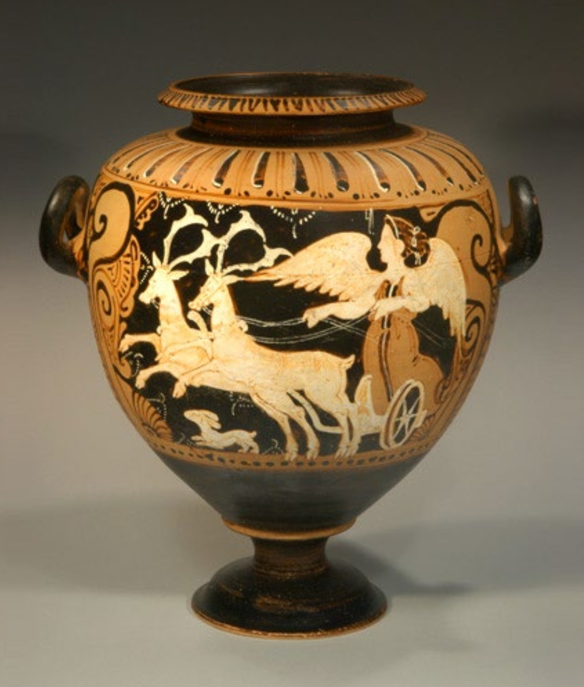

# Day One: The Etruscan Vase

The main goal of this course is the understand how the world works through video
games. In order to achieve this goal, we will have to look at video games as
cultural artifacts. Artifacts exist through all of human history, because work
does not necessarily come before "play". We may think of having to go to a 9-5
job before performing leisure, but humans have always produced stories and art.
This is why to understand culture we must be able to analyze the artifacts it 
produces.

In this way this course brings together both the arts and humanities. **Art** is
the study of the history and making of objects we call art. **Humanities** is the
study of the history of all human life and activity.

## Facing the Artifact

When examining an artifact there are some basic questions you may ask of it.

### Questions

* When is this from?
* What is it?
* Who made it?
* How is the object exchanged?
* Why was it made?
* What is it for?
* What information can I gather about the manufacturer/maker?
* Is this object priceless or sentimental?
* What influenced the making of this object?
* What did this object influence?
* What does it depict and why?

### Primary vs. Secondary Characteristic

Primary and secondary characteristics are important aspects of analyzing a cultural
artifact. A **primary** characteristic is something included for the intended and
conscious use of the object. For a statue the shape would be a primary characteristic.
For a game the dialogue would be a primary characteristic. A **secondary** characteristic
is something non-primary that happened to be there. For a statue the weight is a
secondary characteristic. For a video game the storage size is a secondary characteristic.

## The Etruscan Vase

```{r, out.width = "200px", echo=FALSE}

```

The Etruscan Vase is an example of a cultural artifact. To get some context about
where this artifact was made we could find out that Etruia is in Northern Italy
and the people existed there from about 800 to 300 BCE. The image on the vase depicts
Artemis and her stags. So something to question is what aspects are intentional and
what is unintentional?

### Passage

```{r, out.width = "400px", echo=FALSE}

```

Passage is another example of a cultural artifact. In this case passage is a video
game. Some important context for this game is that it was actually made around 2010.
The game looks as if it was an older game from the 80s perhaps, but since it was
manufactured recently it must be a design choice and not a secondary characteristic.
In this class we will use video games such as passage as an Etruscan Vase.

## Phatic Exchange

A phatic exchange between two people is an exchange in which the words are meaningless
and it is mostly to build rapport between the two parties. An example of this is
the We Are chant or saying I love you to a partner after establishing that as a fact.

# Day Two

## Evolutionary Psychology

Evolutionary psychology is an attempt to understand culture as a result of natural
selection. Natural selection is the phenomenon where traits that increase survivability
remain. This begs the question why do we tell stories and does this aesthetic
activity/pleasure/leisure increase survivability?

An example of natural selection would be the lactose tolerant single gene mutation.
This mutation allows us to consume dairy and has occurred multiple times throughout
history, but the gene did not become common until the neolithic era where people
began raising cattle and the dairy became another source of sustenance.

### Proposed sources of cultural evolution

* Sexual selection - sexually attracted to storytellers
* Cognitive workout - stories help to extend mental capacity
* Instruction/Social Glue - teaching!
* Accidental byproduct - there is no explanation

## Stories

The claim is that culture is highly materialized and stories have existed over the
entire course of human history. A story is a mode of human interaction, but that 
mode materializes in different forms. An import thing to note is that the chang
of culture is **not** strictly progressive. Furthermore story precedes history, which
is a made form.

### Two Forms of a story

1. Chronicle; A list of events following right after one another.
2. Historical work; An account of what happened and **why**

## Genres

All cultural artifacts have a genre; a type to which they belong and which determines
their meaning. Genres are not strictly defined. Artifacts are also determined partly,
but not completely by their historical context. Genres are also historically determined.
For example, the romantic novel emerged long before the detective mystery.

## Gamergate

Gotschall states that the differences between they way girls play and the way boys
play can be explained by the fact that biological evolution has not caught up to
cultural evolution. When Anita reviewed some games and talked about the way they
depicted women she got a huge backlash from the gaming community upset that she was
attacking their community.

Note that it seems that girls are able to cross the gender boundary seemingly easier
than guys. We talking about how there is both polciing of this line and encouragement
to cross it.

## Three terms

1. Play is an activity that sometimes happens in games.
2. Sport overlaps with play and games, but not always.
3. Games like sports often involved playing, but not always.

### Adult play

Note that the meaning of adulthood has changed over time. Think about us versus our
grandparents. Adults play in many ways:

* Flirting
* Gambling
* Recreational Sports
* Video Games
* Drinking/Drugs
* Shopping (not buying)

# Day Three

An important concept to understand when it comes to play is the magic circle. The
magic circle is a construct that keeps the game safe from outside forces. For example,
in monopoly you pay rent with the fake money, but if you offered real money then
you would be breaking or breaching that magic circle.

When we come to analyze video games we must understand they are a unique cultural
artifact. Unlike books and movies they have not penetrated the entire market. Think
about what would happen if you asked a random person if they have ever seen a movie
versus ever played a video game. To understand what work culture is doing you must
understand how it distorts reality/expectations such as Ice Cube's west coast style
on a Public Enemy song.

## Five Faces of Play

### Agon

### Alea

### Mimicry

### Ilinx

### Muthos

# Day Four

# Day Five

# Day Six

# Day Seven

# Day Eight


