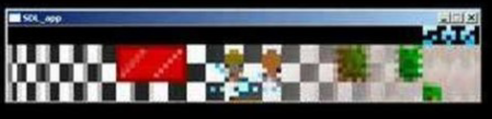

# Day One: The Etruscan Vase

The main goal of this course is the understand how the world works through video
games. In order to achieve this goal, we will have to look at video games as
cultural artifacts. Artifacts exist through all of human history, because work
does not necessarily come before "play". We may think of having to go to a 9-5
job before performing leisure, but humans have always produced stories and art.
This is why to understand culture we must be able to analyze the artifacts it 
produces.

In this way this course brings together both the arts and humanities. **Art** is
the study of the history and making of objects we call art. **Humanities** is the
study of the history of all human life and activity.

## Facing the Artifact

When examining an artifact there are some basic questions you may ask of it.

### Questions

* When is this from?
* What is it?
* Who made it?
* How is the object exchanged?
* Why was it made?
* What is it for?
* What information can I gather about the manufacturer/maker?
* Is this object priceless or sentimental?
* What influenced the making of this object?
* What did this object influence?
* What does it depict and why?

### Primary vs. Secondary Characteristic

Primary and secondary characteristics are important aspects of analyzing a cultural
artifact. A **primary** characteristic is something included for the intended and
conscious use of the object. For a statue the shape would be a primary characteristic.
For a game the dialogue would be a primary characteristic. A **secondary** characteristic
is something non-primary that happened to be there. For a statue the weight is a
secondary characteristic. For a video game the storage size is a secondary characteristic.

## The Etruscan Vase

```{r, out.width = "200px", echo=FALSE}

```

The Etruscan Vase is an example of a cultural artifact. To get some context about
where this artifact was made we could find out that Etruia is in Northern Italy
and the people existed there from about 800 to 300 BCE. The image on the vase depicts
Artemis and her stags. So something to question is what aspects are intentional and
what is unintentional?

### Passage

```{r, out.width = "400px", echo=FALSE}

```

Passage is another example of a cultural artifact. In this case passage is a video
game. Some important context for this game is that it was actually made around 2010.
The game looks as if it was an older game from the 80s perhaps, but since it was
manufactured recently it must be a design choice and not a secondary characteristic.
In this class we will use video games such as passage as an Etruscan Vase.

## Phatic Exchange

A phatic exchange between two people is an exchange in which the words are meaningless
and it is mostly to build rapport between the two parties. An example of this is
the We Are chant or saying I love you to a partner after establishing that as a fact.

# Day Two

# Day Three

# Day Four

# Day Five

# Day Six

# Day Seven

# Day Eight


