```{r include=FALSE}
library(tidyverse)
```

# Theory Questions

## Problem 1

Show that if you use the line equations $\rho = xcos\theta+ysin\theta$, each image
point (x,y) results in a sinusoid in ($\rho,\theta$) Hough space. Relate the amplitude
and phase of the sinusoid to the point(x,y).

In Hough space the coordinates are $\rho$ and $\theta$. Say we have a simple sin
formula in x,y space. This is represented as $y = sin(x)$. Similarly $y = cos(x) + sin(x)$
is also a sinusoidal equation, which can be seen below.

```{r echo=FALSE}
x <- seq(0, 2 * 3.14159, 0.001)
y <- sin(x) + cos(x)

df <- data.frame(y = y, x = x)
df %>%
  ggplot(aes(x=x,y=y)) +
  geom_line()
```

Since in hough space the parameters are instead $\rho$ and $\theta$, this means
the same function in Hough space would be written as $\rho = cos(\theta) + sin(\theta)$.
This makes the form of a line equation in (x,y) space $\rho = xcos\theta+ysin\theta$ show
as a sinusoid in Hough space.

We know that in $x\cos\theta+y\sin\theta$ we can write $x = R\cos\alpha,y=R\sin\alpha$.
Furthermore $R\cos\alpha\cos\theta+R\sin\alpha\sin\theta = R\cos(\alpha - \theta)$.
From here we can determine that R is the amplitude of the function and $\alpha$ is
the phase. We know that $x^2 + y^2 = R^2\cos^2\alpha + R^2\sin^2\alpha = R^2(1)$, so
$R = \sqrt{x^2 + y^2}$. This would be the sinusoid **amplitude** in terms of (x,y).
We also know that $\frac{R\sin\alpha}{R\cos\alpha} = \frac{y}{x} = \tan\alpha$, so
the **phase** is $\alpha = \arctan\frac{y}{x}$ in terms of (x,y).

## Problem 2

Why do we parameterize the line in terms of ($\rho, \theta$) instead of the slope
and intercept (m,c)? Express the slope and intercept in terms of ($\rho, \theta$).

One of the reasons we parameterize the line in terms of ($\rho, \theta$) instead
of the slope and intercept is to be able to identify vertical lines. They appear
as parallel when casting to parameter space: $b = -mx + y$, since x is constant.

Say we have the lines $x = 4$, and $y = 5$. On the first line we could have the points
(4,0), (4, 3), and (4, -2). The second line we could have (0,5), (-3, 5) and (2, 5).
Below we can compare the image space points to the lines in Hough Space.

```{r echo=FALSE}
m <- seq(-5, 5, 0.1)
b <- -1 * m *4 # (4,0)
df <- data.frame(m = m, b = b, label=rep("(4,0)", length(m)))
df <- df %>% rbind(data.frame(m = m, b = (-1 * m * 4 + 3), label=rep("(4,3)", length(m))))
df <- df %>% rbind(data.frame(m = m, b = (-1 * m * 4 - 2), label=rep("(4,-2)", length(m))))

df %>%
  ggplot(aes(x=m,y=b,color=label)) +
  geom_line()
```

So let's express the slope and intercept as ($\rho, \theta$). This lets use see
points as sinusoids instead of lines (so they will not be parallel), and it lets
us see lines as unique points. Take our line equation and phrase it as $y = mx + b$.

\[\rho = xcos\theta+ysin\theta\]
\[\rho - xcos\theta = ysin\theta\]
\[y = \frac{\rho - xcos\theta}{sin\theta}\]
\[y = \frac{-xcos\theta}{sin\theta} + \frac{\rho}{sin\theta}\]
\[y = -\cot\theta*x + \csc\theta * rho\]

We can now see in the slope intercept form that the slope would be $m = -\cot\theta$
and the intercept would be $c = \csc\theta * rho$.

## Problem 3

Assuming that the image points (x,y) are in an image of width W and height H, that
is $x \in [1, W], y\in [1,H]$, what is the maximum absolute value of $\rho$, and what
is the range for $\theta$?

The maximum absolute value of $\rho = \sqrt{W^2 + H^2}$, since this is the value of the
amplitude of the line function found in problem 1.

For $\theta$ we would only have to look between 0 and $2\pi$ to see all values of $\rho$.

## Problem 4

For point (10, 10) and points (20, 20) and (30, 30) in the image, plot the corresponding
sinusoid waves in Hough space, and visualize how their intersection point defines
the line. What is (m, c) for this line?

```{r echo=FALSE}
m <- seq(-3, 3, 0.1)
b <- -1 * m *10 + 10 # (4,0)
df <- data.frame(m = m, b = b, label=rep("(10,10)", length(m)))
df <- df %>% rbind(data.frame(m = m, b = (-1 * m * 20 + 20), label=rep("(20,20)", length(m))))
df <- df %>% rbind(data.frame(m = m, b = (-1 * m * 30 + 30), label=rep("(30,30)", length(m))))

df %>%
  ggplot(aes(x=m,y=b,color=label)) +
  geom_line()
```

It is clear that in Hough space, these three image points intersect at (m,c) = (1,0). This corresponds
to the line $y = mx + b = x$. This can be seen below.

```{r echo=FALSE}
m <- seq(0, 35, 0.1)
b <- m
df <- data.frame(m = m, b = b)
m <- c(10, 20, 30)
b <- m
df_points <- data.frame(m=m, b=b)

df %>%
  ggplot(aes(x=m,y=b)) +
  geom_line() +
  geom_point(data = df_points, aes(x=m, y=b), inherit.aes = FALSE)
```


# Implementation Images

```{r, out.width = "200px", echo=FALSE}
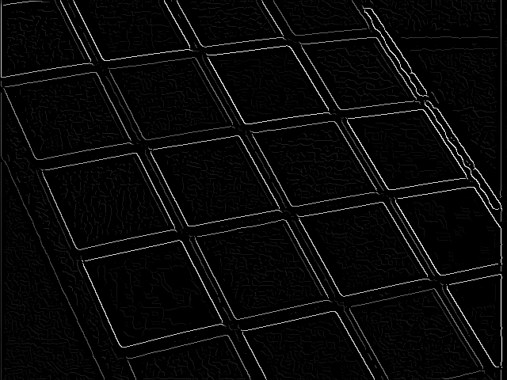
```

```{r, out.width = "200px", echo=FALSE}
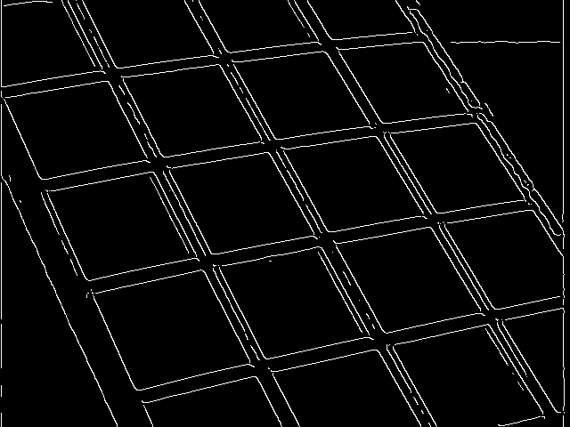
```

```{r, out.width = "200px", echo=FALSE}
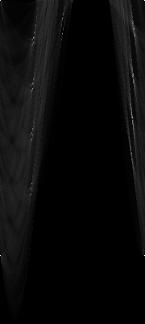
```

```{r, out.width = "200px", echo=FALSE}
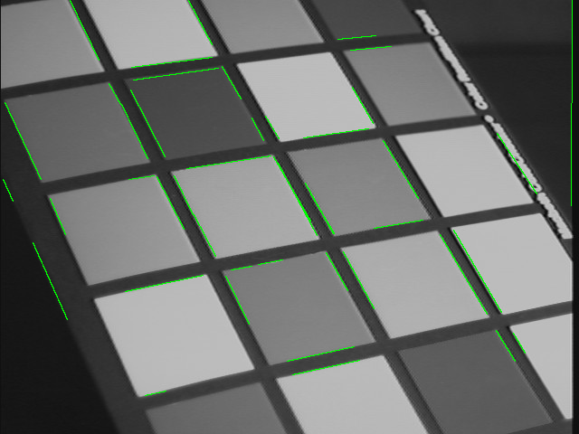
```

# Experimentation

Logically if we use a higher sigma on our Gaussian filter we will smooth out more noise. This combined with
an increased "MinLength" parameter in hough lines puts a heavy emphasis on only displaying
longer and more distinct edges. This can be seen below where the first image has a lower sigma
and "MinLength" and the second has higher values.

```{r, out.width = "200px", echo=FALSE}
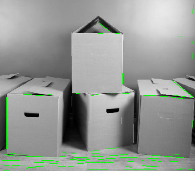
```

```{r, out.width = "200px", echo=FALSE}
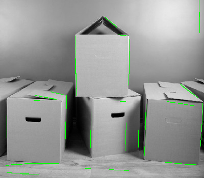
```

Having a high threshold value made the biggest difference if you only desired very distinct
line. This can be seen in the transition from the above images to the image below.
The image below has the same Gaussian filter as the first box image, but a higher
threshold.

```{r, out.width = "200px", echo=FALSE}
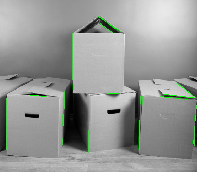
```

You can also see how shadows will show up in edge detection. The transition from a bright
area of light to the dark shadow will appear as one of the top lines when there is a very
distinct separation between the bright and dark regions. This can be seen in the following
images.

```{r, out.width = "200px", echo=FALSE}
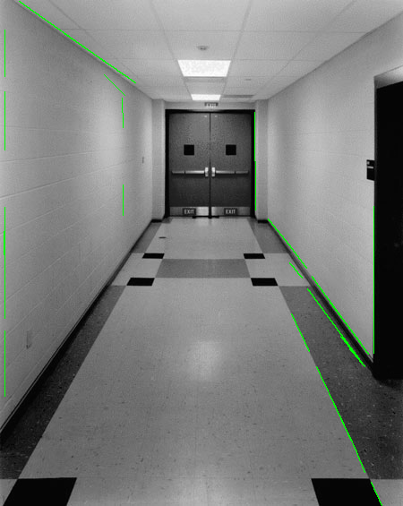
```

```{r, out.width = "200px", echo=FALSE}
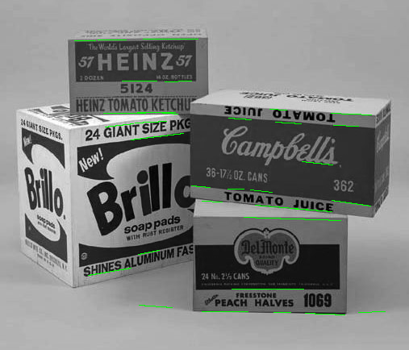
```

The step of the algorithm with the largest problem is definitely choosing the peaks
to use to display your lines that are considered edges. Non-maximum suppression and
thresholding are vital tools in obtaining a Hough transform accumulator with good peaks.

The parameter that made a huge impact from image to image was actually the resolution
of the Hough Transform accumulator. Since each image is a different resolution, the
range for rho changed, and if the resolution was too low, then the voting for different
lines got merged from multiple into a single point, but if the resolution was too
fine then really distinct lines had their votes turn from a single point into multiple points.
In this way a fine resolution sort of acts like a threshold in and of itself. You can
see this below through differing resolutions.

```{r, out.width = "200px", echo=FALSE}
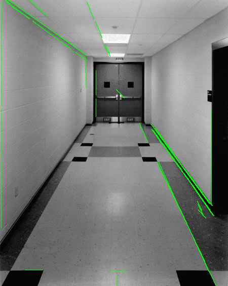
```

```{r, out.width = "200px", echo=FALSE}
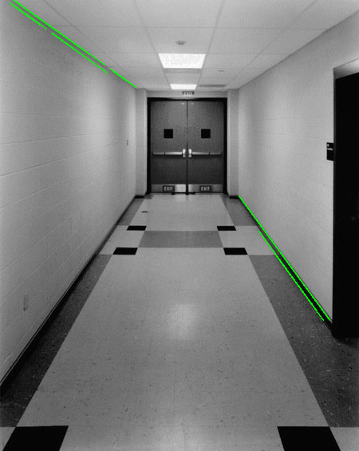
```

There was no set of parameters that was optimal for all the images. Each image is
a different resolution with a different amount of noise and edges with differing
degrees of magnitude. For example, the checkerboard and pot on book images have
really extreme values on their edges, so the optimal set of parameters for these images
cause a lot of hough lines in the floor, grass, and other noiser areas of the other images.
The images with less defined lines required higher thresholding and more stringent
criteria for the houghlines "MinLength" function.

# My Images
