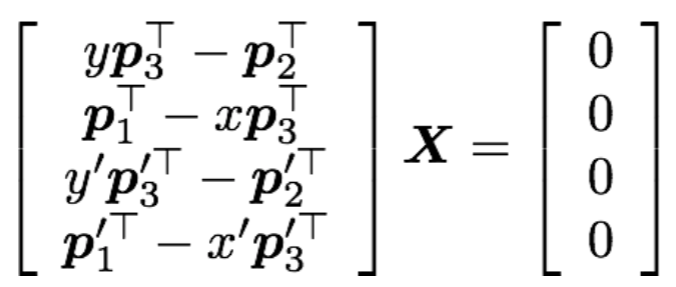

# Project Summary

This project involved tranlations of data into various coordinate systems. Being able to translate between coordinate systems combined with triangulation allows motion capture data to be projected onto camera image planes, but also verify the ability of motion capture to be recovered from only the camera images. There were three main steps to this system. The first main aspect to the project was translating 3D world points into a 2D image plane. To perform this translation I used both the intrinsic and extrinsic camera calibration to parameters to first translate the 3D world motion capture point into the camera coordinate system. Once the 3D point was in the camera coordinate system it could be projected onto the 2D image plane. The second part of the project was the ability to recover data points from two 2D image planes. To recover the points from the two camera images I triangulated the position using the camera calibration parameters. The final part of the project was visualizing the results, which appear to show a successful triangulation and coordinate translations.

# Matlab Implementation

The matlab implementation was fairly linear with the most interesting part the epipolar geometry visualization. There were two subroutines for visualization purposes and three functions for mathematical calculations. These five functions were all called by the main project two program. 

The first function was the world to image translation function called worldToImage. This function merely used the Pmat and Kmat camera calibration parameters, since these two parameters allowed for the extrinsic and intrinsic translations. After multiplying the world point by these two parameters the function normalized the output for the image plane.

The second function was the triangulation function. The triangulation function took the image coordinates for each camera (calculated from worldToImage) along with the calibration structures and recovered the 3D world points through triangulation. This function was essentially the following formula and solving with SVD:

```{r, out.width = "400px", echo=FALSE}

```

The third function calculated the L2 norm for the one or more world points passed as parameters. The L2 norm was found by subtracting elementwise (x - x'), then squaring elementwise and performing a summation along each coordinate pair.

The epipolar geometry visualzation was the most interesting subroutine. This function was unique, but fairly straightforward. The function starts by finding the epipoles using the concept that the epipoles are the projection of the other camera onto the current camera's image plane, then the epipolar lines were drawn by using each joint point along with the epipole.

The skeleton construction is a fairly straightforward function and follows along explicitly with the instructions in the project assignment.

## Camera Calibration

* What are the internal parameters?
    + foclen
    + prinpoint
    + Kmat
* Which are the external parameters?
    + orientation
    + position
    + Pmat
    + Rmat
* Which internal parameters combine to form Kmat?
    + foclen
    + prinpoint
* Which external parameters combine to form Pmat?
    + position
    + Rmat
* What is location of the camera?
    + position
* Verify that location and Rmat combine to form Pmat.

Structure:

* foclen: focal length, intrinsic
* orientation: direction camera principal axis is facing, extrinsic
* position: location of camera in world coordinates, extrinsic
* prinpoint: origin shift from principal axis (px, py in K) , intrinsic
* radial: distortion
* Pmat: extrinsinc transform (world to camera coords) -> combination of position and Rmat
* Rmat: rotation matrix
* Kmat: composed of focal length and principal points (origin shift) -> intrinsic transform (camera to image plane)

# Evaluation

## Quantitative

### Error statistics

```{}
% Calculate L2 error for each pair
% load data for all frames with confidence of 1
x = zeros(1,size(mocapJoints,2));
y = zeros(1,size(mocapJoints,2));
z = zeros(1,size(mocapJoints,2));
totalError = zeros(1);
errFrames = zeros(1);
ind = 1;
for frame = 1:size(mocapJoints,1)
    if sum(mocapJoints(frame,:,4)) == 12
        x(ind,:) = mocapJoints(frame,:,1);
        y(ind,:) = mocapJoints(frame,:,2);
        z(ind,:) = mocapJoints(frame,:,3);
        worldCoords = [x(ind,:); y(ind,:); z(ind,:)];
        imageCoords1 = worldToImage(worldCoords, vue2);
        imageCoords2 = worldToImage(worldCoords, vue4);
        recovered = triangulate(imageCoords1, imageCoords2, vue2, vue4);
        totalError(ind) = sum(L2(recovered, worldCoords));
        errFrames(ind) = frame;
        ind = ind + 1;
    end
end

% each joint stats
for i = 1:size(mocapJoints,2)
    worldCoords = [x(:,i)'; y(:,i)'; z(:,i)'];
    imageCoords1 = worldToImage(worldCoords, vue2);
    imageCoords2 = worldToImage(worldCoords, vue4);
    recovered = triangulate(imageCoords1, imageCoords2, vue2, vue4);
    values = L2(recovered, worldCoords);
    fprintf('Joint: %d\n',i);
    fprintf('Mean: %d\n',mean(values));
    fprintf('Stdev: %d\n',std(values));
    fprintf('Minimum: %d\n',min(values));
    fprintf('Median: %d\n',median(values));
    fprintf('Maximum: %d\n\n',max(values));
end

% all joint stats
worldCoords = [reshape(x(:,:),1,[]); reshape(y(:,:),1,[]); reshape(z(:,:),1,[])];
imageCoords1 = worldToImage(worldCoords, vue2);
imageCoords2 = worldToImage(worldCoords, vue4);
recovered = triangulate(imageCoords1, imageCoords2, vue2, vue4);
values = L2(recovered, worldCoords);
disp('Entire dataset L2 error stats');
fprintf('Mean: %d\n',mean(values));
fprintf('Stdev: %d\n',std(values));
fprintf('Minimum: %d\n',min(values));
fprintf('Median: %d\n',median(values));
fprintf('Maximum: %d\n\n',max(values));

figure(3)
plot(1:size(totalError,2), totalError);
```

| JointNumber | Mean         | Std          | Min          | Median       | Max          |
|-------------|--------------|--------------|--------------|--------------|--------------|
| 1           | 1.017327e-19 | 3.105695e-19 | 7.888609e-31 | 1.676624e-20 | 9.538681e-18 |
| 2           | 1.101763e-19 | 3.118945e-19 | 1.097940e-25 | 1.524107e-20 | 6.473228e-18 |
| 3           | 1.161863e-19 | 3.123228e-19 | 2.178834e-26 | 1.495297e-20 | 6.531115e-18 |
| 4           | 7.961800e-20 | 2.153479e-19 | 7.815294e-27 | 1.302832e-20 | 5.077533e-18 |
| 5           | 8.028671e-20 | 2.293042e-19 | 8.535475e-27 | 1.050413e-20 | 4.829420e-18 |
| 6           | 9.648185e-20 | 2.842600e-19 | 4.090244e-27 | 1.090551e-20 | 9.291231e-18 |
| 7           | 8.478055e-20 | 2.554924e-19 | 1.616849e-26 | 1.187546e-20 | 5.475463e-18 |
| 8           | 9.069420e-20 | 2.611611e-19 | 1.539856e-26 | 1.209223e-20 | 5.952429e-18 |
| 9           | 9.796018e-20 | 2.931349e-19 | 1.090521e-26 | 1.145720e-20 | 8.334312e-18 |
| 10          | 7.595843e-20 | 2.264355e-19 | 1.797341e-26 | 9.806524e-21 | 5.605303e-18 |
| 11          | 7.087689e-20 | 2.171939e-19 | 1.230820e-27 | 7.456308e-21 | 4.400264e-18 |
| 12          | 7.057043e-20 | 2.270063e-19 | 3.317002e-26 | 5.788178e-21 | 4.230645e-18 |
| 13          | 8.961020e-20 | 2.650311e-19 | 7.888609e-31 | 1.110152e-20 | 9.538681e-18 |

### Total Error

```{r, out.width = "400px", echo=FALSE}
knitr::include_graphics("./totalError.png")
```

## Qualitative

### Minimum Error Frame

```{r, out.width = "400px", echo=FALSE}

```

### Maximum Error Frame

```{r, out.width = "400px", echo=FALSE}

```

### Input 3D Skeleton

```{r, out.width = "400px", echo=FALSE}

```

There was not a large enough difference between the input and output skeleton to be able to plot on the same image. This can be seen in the demo script.

### Output 3D Skeleton

```{r, out.width = "400px", echo=FALSE}

```

### Epipolar Geometry

```{r, out.width = "400px", echo=FALSE}

```

```{r, out.width = "400px", echo=FALSE}

```

## Efficiency

You can see that the largest time sink was the many calls to the triangulate function with the second most coming from the  many calls to the world to image plane translation.

```{r, out.width = "400px", echo=FALSE}

```


