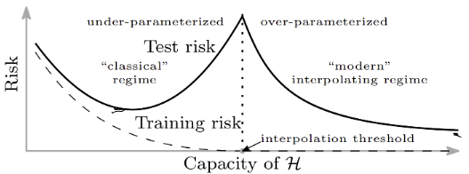
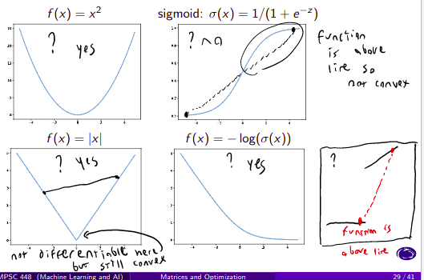
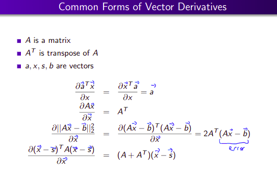
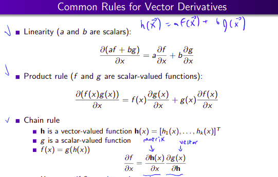

# What is Machine Learning

## Types of Machine Learning

* Supervised Learning
    + Labeled training data, make a **generalization** predication with labels
    + Regression: Predict a number
    + Classification: Predict a class (element from finite set)
* Unsupervised Learning
    + Unlabeled training data, assume x are iid
    + Clustering
    + Outlier detection
* Semi-supervised Learning
    + Mix of labled and unlabeled
    + Unlabeled data is cheap
    + Labeling images
* Online Learning
    + **Batch** learning we get all data at once
    + Online learning = on the job training (one at a time)
    + Spam detection
* Active Learning
    + Learning with a teacher
    + Learner asks for correct answer (only ask for unsure answers)
* Transfer Learning
    + Reuse a model for a different task
    + Universal Approximation
* Reinforcement Learning
    + Agents that act in an environment
    + Playing games
    
### Polynomial Regression

Polynomial regression is an example of supervised learning. We build a **regression** model to predict t values from x values. The first step in this model is Feature Engineering, where we can create a polynomial of degree k, by doing $x^a$ for any $a \in[0,k]$. We would then multiply each of those values by a weight vector, which is a parameter for our model. This is a linear model, because the parameters are linear.

**Overfitting** occurrs when a model fits noisy data very closely. This happens when you have very low bias, but very high variance. Bias is the model distance from the true valules, and variance is the randomness that can occurr in the resulting model.

**Expected error** for a model is composed of noise (**Bayes error**), bias, and variance. We can improve performance by restricting number of parameters, increasing our training set or using regularization.

## Regularization

L2 regularization (w is weight vector):

\[\lambda\Sigma_{j=1}^kw_j^2\]

L1 regularization:

\[\lambda\Sigma_{j=1}^k|w_j|\]

Modern practice is to make models complex enough to overfit and then add in regularization.

```{r, out.width = "400px", echo=FALSE}

```

# Model Selection and Evaluation

Model: A model is a function that takes and example and outputs a prediction. An example would be polynomial regression with degree k and weights w.

Model Class: A set of models like polynomial regression, where each choice of k and w would be a different model.

Models have both parameters and hyperparameters. The line between the two is fuzzy, but the parameters can be chosen from the training data, while the hyperparameters must be chosen some other way. We train parameters on training data using a loss function. An **objective function** is the sum of loss functions over all samples (or data points). This makes our objective to minimize the objective function.

Remember we use a training data set to train our parameters, then test on a test set, which is data the model has not seen before. The test set is used to capture the accuracy of the model. A validation set is often used to help train hyperprameters. This gives us three groups of data: train, validation, test.

## k-fold Cross Validation

k-fold cross validation is a method used to select hyperparamters.

1. Divide data set into k disjoint folds.
2. Get an error estimate $e_i$ in fold i.
    + Combine all folds except fold i intro train set.
    + Use fold i as test set.
3. Compute the average $e_i$

The hyperparamter will the lower average error $e_i$ is usually better. You should try several different values of k. The results from this should not be very great, or you cannot trust your results.

## Garbage In = Garbage Out

Watch out for misleading features. Some examples we used were batting averages. They illustrated Simpson's paradox, where a trend may appear in different groups of data, but disappear when they are combined. Another example used were kidney death rates, which may be explained more by population counts than actual deaths. This illustrates the difference between averagees and frequency counts,  since low populations have a smaller denominator.

Conductors live longer? They are also older, and older people have a longer expected lifespan. We can also get issues with conversions like in our height example.

# Basic Building Blocks

1. Linear discriminants/artificial neurons
    + Input vector x
    + Parameters vector w and scalar b
    + Activation function f
    + Output f(w*x + b)
    + Ex: Linear regression, Perceptron, Logistic regression
    + Can be stacked
2. Kernels
    + K(x, y) maps the x and y vectors to a higher dimension
3. Decision Stumps
    + Defined by chosen feature and decision rule
    + Used in decision trees and random forests
4. Nearest Neighbor/radial based functions

# Inference and Decision Theory

## Inference

After training a machine learning classifer you get k **discriminant** functions. This can be **generative models** P(x and Class j). They can also be **discriminative movels** P(Class j | feature x). You can build both binary and multiclass classifiers. To classify k classes you required k(k-1)/2 classifiers (for 1v1).

## Decision Theory

* Loss Function $C(c_i,c_j)$.
    + Cost of prediction $c_j$ when true class is $c_i$
* Prediction cost for $c_i$
    + $\Sigma_{l=1}^kC(c_l,c_i)P(c_l|x)$
    + This makes your decision to choose the class that minimizes the cost
    
We can also make decisions to not make a prediction. This is the reject option and indicates that more information or human judgement is needed.

**Look at HW2 for examples**

# Randomization

**Look at HW3 for examples**

## Simulation

In simulations we are often testing against a **null hypothesis**. This null is a classifier with a baseline accuracy. We wish to find out how likely it is to get a given accuracy given a model with the baseline accuracy due to randomness.

```{}
# Sample simulation algorithm
k <- large_num
for i in 1 to k:
  # do one sim, n = data set size (X predictions right out of n)
  flip coin p(heads) = baseline for n times
  t_i <- num heads
end

# X is accuracy we are testing against, not baseline
p_values <- (# of t_i >= X) / k
```

The more models we train, the more likely it is that one gets lucky. We must factor this in:

```{}
# Sample simulation algorithm for 10 models
k <- large_num
for i in 1 to k:
  # do one sim, n = data set size (X predictions right out of n)
  for j in 1 to 10
    flip coin p(heads) = baseline for n times
    t_i(j) <- num heads
  end
  test_stat <- max(t_i) # best performing model
end

# X is accuracy we are testing against, not baseline
p_values <- (# of test_stat >= X) / k
```

In our cancer simulation we had the following criteria:

* If you have cancer, 90% of positive test
* If you don't have cancer, 10% of positive test
* Lung cancer rate of 0.05

```{}
# lung cancer sim (estimate P(cancer | positive result))
k <- large_num
for i in 1 to k:
  c_i = coint flip p(heads) = 0.0005 // has cancer?
  if c_i:
    t_i = coin flip with p(heads) = 0.9
  else:
    t_i = coin flip with p(heads) = 0.9
end

result = (# where c_i,t_i = 1) \ # of i where t_i =1
```

## Permutation

All permutation methods follow the same algorithm. Remember to perform the exact same analysis on permuted data as was performed on the original data set.

```{}
k <- large_num
T <- test_stat on original data
for i in 1 to k:
  randomly permute data # least invasive, but correlation breaking
  t_i <- test_stat on permuted data
end

p_value <- (# of t_i more extreme than T) / k
```

## Bootstrapping

Bootstrapping is getting a new dataset from the original dataset by sampling **with** replacement. This can be used to illustrate how sampling variability can affect a model.

1. Create M bootstrap replicate datasets.
2. Build a polynomial regression model on each dataset.
3. Find interval that contains 90% of weights w among the M replicates.

# Optimization

## Sigmoid Function

\[\sigma(z) = \frac{1}{1+e^{-z}}\]

## Gradient Descent

```{}
while convergence criterion not met:
  new_weights <- old_weights - eta(t) * grad(weights)
  t = t+1
```

1. Initialization is very important.
2. Have proper convergance criterion (usually won't converge to point)
3. Learning rate must be small and decrease fast enough to converge.

Some problems with these algorithms is that you can get stuck in local min/max, converge slowly, and computing gradient can be very expensive.

## Mini-batch Gradient descent

```{}
in each epoch shuffle data set
while convergence criterion not met:
  get m training points
  f(w) = minibatch loss
  new_weights <- old_weights - eta(t) * grad(weights)
  t = t+1
```

Remember m point contributions:

\[\frac{m}{n}\lambda||w||^2 + \Sigma_{i=1}^m\text{Loss or gradient}\]

## Convex Optimization

A convex set requires the ability to draw a line between any two points in the set. In a convex function, the line lies under any two connecting points. The function will also always lie above any tangent line (which can be found if f is differentiable). (f'' > 0)

```{r, out.width = "400px", echo=FALSE}

```

# Matrices and Matrix Calculus

```{r, out.width = "400px", echo=FALSE}

```

```{r, out.width = "400px", echo=FALSE}

```

# Inductive Bias

# Universal Approximation

## Nearest Neighbors

# Linear Regression

# Logistic Regression

# Perceptron
